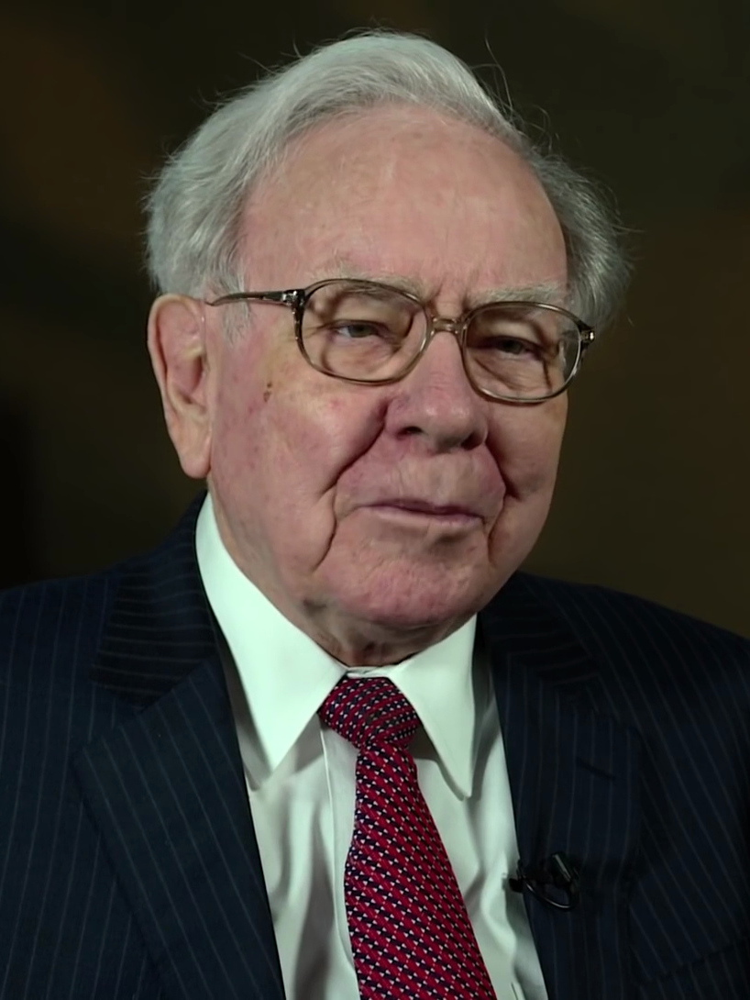

# 巴菲特AI导师 Skill

<div align="center">
  
  <p><em>沃伦·巴菲特 — 奥马哈先知、价值投资之父</em></p>
</div>

基于沃伦·巴菲特投资哲学与人生智慧的 AI 导师技能。收录巴菲特 60 年投资生涯的核心智慧：价值投资原则、经典操盘案例、2024-2025 最新持仓、投资箴言。

## 安装

```bash
git clone https://github.com/cjtdawn-cn/buffett-skill.git
cd buffett-skill
```

无需额外依赖，纯 Python 标准库。

## 使用

```bash
# 提问获取巴菲特风格的投资建议
python buffett_agent.py "苹果股票现在能买吗"
python buffett_agent.py "怎么判断一家公司值不值得投"

# 随机投资箴言
python buffett_agent.py --quote

# 按分类获取箴言
python buffett_agent.py --quote 价值投资
python buffett_agent.py --quote 风险控制
python buffett_agent.py --quote 人生智慧

# 最新持仓概览
python buffett_agent.py --portfolio

# 随机经典投资案例
python buffett_agent.py --case

# 查看巴菲特完整档案
python buffett_agent.py --profile

# 关键词搜索
python buffett_agent.py --search 护城河
```

## 知识库内容

### 投资原则（6大维度，37条语录）

| 分类 | 语录数 | 核心内容 |
|------|--------|----------|
| 价值投资 | 8条 | 安全边际、长期持有、逆向思维 |
| 风险控制 | 6条 | 永不亏损、厌恶杠杆、现金为王 |
| 能力圈 | 4条 | 只投懂的、独立思考、反华尔街 |
| 企业分析 | 5条 | 护城河、ROE、自由现金流 |
| 市场心理 | 3条 | 市场先生、贪婪恐惧、熊市买入 |
| 人生智慧 | 8条 | 声誉至上、终身学习、选择比努力重要 |

### 经典案例（5个）

| 案例 | 年份 | 回报 |
|------|------|------|
| 喜诗糖果 | 1972 | 收购价76倍利润回报 |
| 可口可乐 | 1988 | 29倍 + 年收8亿美元股息 |
| 中国石油 | 2003 | 4年7倍 |
| 比亚迪 | 2008 | 14年33倍 |
| 苹果 | 2016 | 获利超1000亿美元 |

### 2024-2025最新持仓

- 现金储备 **3340亿美元**（历史最高）
- 减持苹果 67%，暂停卖出
- 加仓西方石油、日本五大商社
- 新增星座品牌、达美乐披萨
- 连续 9 季度净卖出，防御姿态

## 接入 AI Agent

### Hermes Agent

将 `SKILL.md` 放入 `~/.hermes/skills/`，对话中 `/巴菲特` 即可触发。

### Claude Code

将 `SKILL.md` 放入 `D:\claude-config\.claude\skills\`，对话中 `/巴菲特` 即可触发。

### 其他 Agent

直接导入 `SKILL.md` 文件，兼容 [agentskills.io](https://agentskills.io) 标准。

## 信息来源

- 1977-2025 年伯克希尔·哈撒韦股东信
- 巴菲特传记《滚雪球》
- CNBC / Bloomberg 专访
- 2024-2025 年 13F 持仓报告
- 2025 年退休前最后一次股东大会

## License

MIT
